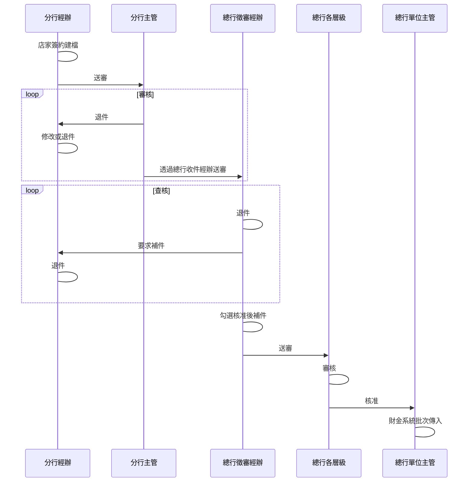

# 會議進度

| 會議主題 | 新契約進件幹部核可作業(R3)                       | 會議日期 | 112/5/22 |
| -------- | -------------------------------------------- | -------- | -------- |
| 會議地點 | 總行8823會議室                               | 記錄人員 | 曾子瑜   |
| 會議時段 | 14:00-15:25                                  | <        | <        |
| 與會人員 | 陽信信用卡部:廖德烊襄理、陳翰一、洪嘉瑋      |          |          |
| ^        | ^陽信資訊處:廬建霖襄理、吳映儀               | ^        | ^        |
| ^        | ^陽信電商:郭彥岐協理、黃聖崴、曾子瑜、林鈺珊 | ^        | ^        |

### 會議內容
1. 進件流程
	1. 退件流程
		1. 總行單位.....
		2. 分行主管
	1. 取消分行輔導
	2. 增加總行
2. 進件狀態及操作
3. 權限
4. 備註

### 待確認/提供事項

---

| >  | 測試   | <   |
| --- | --- | --- |
|     | B   | E   |
| ^   | ^   | ^F  |
| ^   | C   | G   |
| ^   | ^   | ^H  |
| ^   | D   | Z   |
| ^   | ^   | ^X  |
| F   | <   | <   |

# test
只是測試